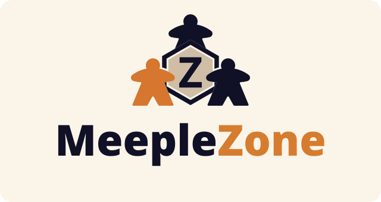
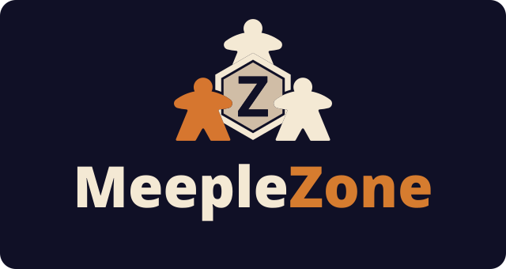

## 1. Pourquoi cette mise à jour ?

Le texte précédent présentait la vision du projet et ses incertitudes. Depuis, plusieurs de ces incertitudes ont été levées et le périmètre a été précisé. Cette mise à jour fait le point sur ce qui a changé, sans réécrire l'historique.

## 2. Un périmètre priorisé avec MoSCoW

La méthode **MoSCoW** classe les fonctionnalités en quatre catégories. L'objectif est de livrer d'abord l'essentiel et d'identifier d'avance ce qui pourrait ne pas entrer dans le temps imparti.

### Must have : indispensable (MVP)

Sans ces fonctionnalités, l'application n'a pas de valeur. Elles sont développées en premier.

* **Catalogue personnel :** enregistrer les jeux de sa collection.
* **Filtrer et classer** sa ludothèque selon ses propres critères : nombre de joueurs, durée d'une partie, mécaniques, complexité.

### Should have : important

Ces fonctionnalités apportent beaucoup de valeur, mais l'application reste utilisable sans elles.

* **Connexion sociale :** s'ajouter en ami avec d'autres utilisateurs.
* **Consultation de la ludothèque d'un ami,** dans le respect de ses préférences de confidentialité, pour découvrir de nouveaux jeux.
* **Prêts entre amis :** faciliter les prêts croisés de jeux.
* **Choix des jeux pour une soirée :** simplifier la sélection des jeux lors de l'organisation d'une soirée entre amis.

### Could have : souhaitable (« nice to have »)

Ces fonctionnalités ne seront réalisées que s'il reste du temps.

* **Calendrier de disponibilité personnelle.**
* **Croisement des disponibilités des invités** pour planifier la prochaine soirée de jeux.
* **Statistiques de jeu :** suivre l'historique et la fréquence des parties.

### Won't have : exclu de cette livraison

Aucune fonctionnalité n'est exclue pour l'instant.

En cas de retard, les fonctionnalités « Could have » seront sacrifiées en premier, puis les « Should have ». Le catalogue est la priorité absolue.

## 3. Choix techniques précisés

Les choix initiaux sont confirmés et complétés. Le délai du projet étant court, plusieurs d'entre eux visent à réduire le temps de développement, afin de concentrer l'effort sur les fonctionnalités principales du site :

* **Langage et framework :** C# (.NET 10) avec Blazor Web App.
* **Interface utilisateur :** bibliothèque de composants **MudBlazor**, retenue pour réduire le temps de développement de l'interface.
* **Base de données :** MySQL / MariaDB était prévue au départ, mais **PostgreSQL** est maintenant envisagée. Le choix sera fait au Jalon 2, en fonction de la qualité du connecteur disponible pour .NET 10.
* **Authentification :** connexion uniquement avec un compte **Google** ou **Microsoft**, sans connexion locale, afin de réduire le temps de développement. L'application ne gère ainsi aucun mot de passe : il n'y a ni stockage, ni mot de passe oublié, ni changement de mot de passe à développer et à maintenir.
* **Qualité :** tests unitaires automatisés avec xUnit, dans une approche TDD.
* **Intégration continue :** une chaîne GitHub Actions compile et teste toutes les solutions .NET placées dans le dossier `code source`, ce qui permettra d'y ajouter d'autres projets sans modifier la configuration.
* **Déploiement :** auto-hébergement dans un HomeLab personnel via Docker.

## 4. Identité visuelle

Le nom du projet est maintenant fixé : **MeepleZone**. Une identité visuelle a été définie pour l'accompagner :

* **Couleurs :** orange `#D67C2F` et bleu très foncé *Galaxie Deep* `#101026`, sur un fond crème.
* **Typographie :** Open Sans pour le texte courant.
* **Logo :** trois meeples autour d'un hexagone portant la lettre « Z », décliné en version claire et en version pour fond sombre. Le nom s'écrit en deux couleurs : *Meeple* dans la teinte foncée (ou crème sur fond sombre) et *Zone* en orange.

Ces éléments sont déjà appliqués à la page d'accueil de l'application.

## 5. Incertitudes restantes

* **L'interface utilisateur :** MudBlazor et l'identité visuelle réduisent le risque, mais il reste à valider que cette approche suffit pour les écrans du catalogue.
* **La base de données :** MariaDB/MySQL ou PostgreSQL. Il faut vérifier la qualité du connecteur pour .NET 10 avant de trancher.
* **Le déploiement continu (CD) :** l'intégration continue (compilation et tests) est configurée, mais la façon d'automatiser le déploiement vers l'environnement Docker auto-hébergé reste à déterminer.
* **La faisabilité dans le temps restant :** la priorisation MoSCoW est la réponse à ce risque. Elle permet de protéger le noyau de l'application si le temps manque.

## 6. Prochaines étapes

* Choisir le moteur de base de données et vérifier le connecteur pour .NET 10.
* Concevoir l'architecture et le modèle de données du catalogue.
* Concevoir l'authentification avec Google et Microsoft.
* Définir une stratégie de déploiement continu vers le HomeLab.
* Écrire les premiers tests unitaires du domaine, avant l'implémentation.
